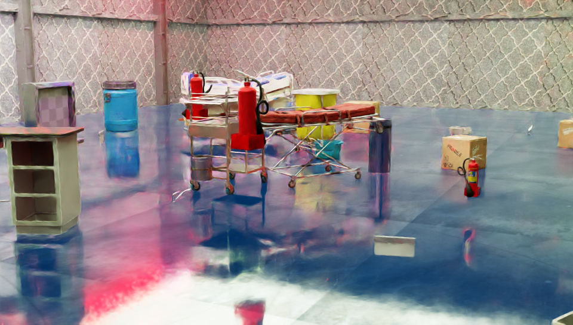
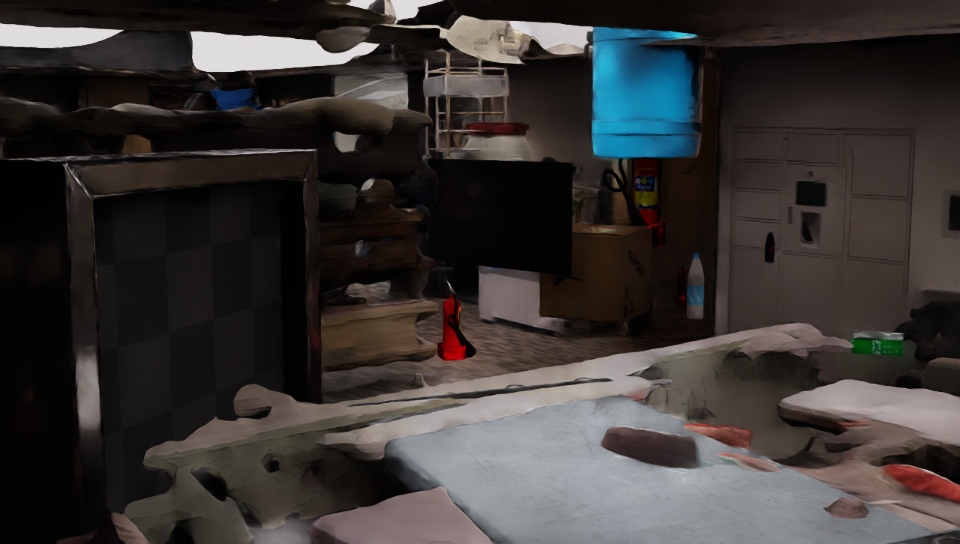
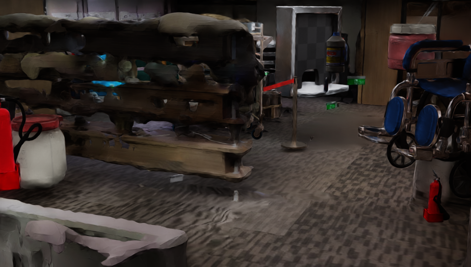

# Synthetic Data Generation and Training with Sim Ready Assets
This project provides a workflow for Training Computer Vision models with Synthetic Data. We will use Isaac Sim with Omniverse Replicator to generate data for our use case and objects of interest. To ensure seamless compatibility with model training, the data generated is in the KITTI format. 

## Workflow Components:
* Generating Data: Use Isaac Sim to generate data
* Training: Use YOLOv10 to train a model for object detection

### SDG 
- Use any object with usd file

- Carry out Domain Randomization in the scene with Replicator:
    - Various attributes of the scene like lighting, textures, object pose and materials can be modified 
    - Important to generate a good quality dataset to ensure model detects objects in the real world

- Data output KITTI format
    - We will use the KITTI Writer for generating annotations
    - Possible to implement a custom writer (can be useful when data is expected in a certain format for your model)

#### Requirements
- Install Isaac Sim [Omniverse](https://www.nvidia.com/zh-tw/omniverse/)
- Create a local Nucleus server with both account and password `admin` and put your target 3D models into the server

#### How to generate data
First add the path in the nucleus server of target objects in [random_objects.py](random_objects.py), then modify the path of isaac sim, output path, and the output image spec in [generate_data.sh](generate_data.sh)

After modifying poth scripts, run:
```
bash generate_data.sh
```

- Sample generated images:

<p>
    
    
</p>

<p>
    
    
</p>

### Training
***Note***
You can follow the original guide in [README.md](yolov10\README.md), or you can follow my guide, but both require changing kitti format to yolo format. To do so: First add all the classes of your target in [kitti_label.py](kitti_label.py) then run
```
bash kitti_to_yolo.sh
```

After changing the format, run [write.py](yolov10\write.py) and modify [data.yaml](yolov10\data.yaml), and you can run [train.py](yolov10\train.py) for training

### Inference
- Use [myapp.py](yolov10\myapp.py) for an app inference tool
- Use [detect.py](yolov10\detect.py) for instance inference with rgb camera

## References:
- Model [Yolov10](https://github.com/THU-MIG/yolov10) are used for object detection

